# Design Document: Code Quality Improvement

## Overview

This design covers a systematic code-quality, maintainability, and scalability improvement pass for the RegAssess codebase — a React 19 + TypeScript + Vite application that implements a regulatory change-assessment workflow for AI/ML medical devices. The codebase is approximately 30 source files across `src/` and `tests/`, with an assessment engine, content library, UI components, and supporting analysis modules.

The audit identified concrete issues across six categories: dead/unused code, duplicated logic, type-safety gaps, suppression patterns, oversized components, and fragile cross-file patterns. The design proposes minimum-change fixes grouped into incremental, reviewable tasks — each independently validatable with typecheck, lint, and tests.

## Architecture

The current architecture is a single-page React app with a layered structure:

```mermaid
graph TD
    subgraph UI["UI Layer (src/components/)"]
        App["App.tsx (orchestrator)"]
        Dashboard["DashboardPage"]
        QCard["QuestionCard"]
        Review["ReviewPanel"]
        Feedback["FeedbackSurvey"]
        Handoff["HandoffPage"]
        Layout["Layout"]
        UI_Shared["ui.tsx (GuidanceRef, HelpTextWithLinks, AuthorityTag)"]
        Icon["Icon"]
        Brand["BrandMark"]
    end

    subgraph Engine["Assessment Engine (src/lib/assessment-engine/)"]
        Types["types.ts"]
        GetQ["getQuestions.ts"]
        CompDet["computeDetermination.ts"]
        CompDS["computeDerivedState.ts"]
        ChangeTax["changeTaxonomy.ts"]
        EngIndex["index.ts (barrel)"]
    end

    subgraph Analysis["Analysis Layer (src/lib/)"]
        CaseReason["case-specific-reasoning.ts"]
        ReviewIns["review-insights.ts"]
        EvidGaps["evidence-gaps.ts"]
        ReportBasis["report-basis.ts"]
        ReportGen["report-generator.ts"]
        ChangeUtils["change-utils.ts"]
        SourceClass["source-classification.ts"]
    end

    subgraph Content["Content Layer (src/lib/content/)"]
        Reasoning["reasoning.ts"]
        DocReqs["doc-requirements.ts"]
        RegSources["regulatory-sources.ts"]
        ContentIndex["index.ts (barrel)"]
    end

    subgraph Services["Services"]
        FeedSvc["feedback-service.ts"]
        FeedTypes["feedback-types.ts"]
        AssessStore["assessment-store.ts"]
    end

    App --> Dashboard & QCard & Review & Feedback & Handoff & Layout & Icon
    App --> EngIndex
    Review --> CaseReason & ReviewIns & EvidGaps & ReportBasis & UI_Shared & ContentIndex
    CaseReason --> ChangeUtils
    ReviewIns --> ChangeUtils
    ChangeUtils --> EngIndex
    Feedback --> FeedSvc & FeedTypes
    Handoff --> EngIndex
    QCard --> UI_Shared & ContentIndex
```



## Audit Findings

### 1. Dead / Unused Code

| Item | Location | Evidence |
|------|----------|----------|
| `fireEvent` import | `tests/feedback-survey.spec.tsx:2` | Imported from `@testing-library/react` but never called — only `userEvent` is used |
| Trivial structural contract test | `tests/app-shell.spec.ts:121-126` | `'dashboard -> assess is the expected navigation order'` test asserts a hardcoded literal equals itself — zero coverage value |

### 2. Duplicated / Redundant Code

| Item | Locations | Description |
|------|-----------|-------------|
| GenAI detection logic | `computeDerivedState.ts:5` and `report-basis.ts:14-19` (`hasGenerativeAIContext`) | Identical check for LLM/Foundation/Generative in `A6` array, implemented independently in two files. `computeDerivedState` returns `hasGenAI`; `report-basis` has a private `hasGenerativeAIContext` function doing the same thing |
| `getChangeLabel` wrapper | `case-specific-reasoning.ts:57-58` | Imports `getChangeLabel` from `change-utils.ts` then re-aliases it as a local `getChangeLabel` with a different default fallback. This is a thin wrapper that obscures the shared function |
| `bannerStyle` inline objects | `App.tsx:37-53` | `warning` and `danger` banner styles are nearly identical objects (differ only in color variable names). Pattern repeats in the `renderBlockContent` method with additional inline style objects for similar banners |
| Repeated `localStorage.removeItem` pattern | `App.tsx:225-230` and `App.tsx:280-283` | `handleReset` and `handleFullAssessment` both clear the same two localStorage keys with identical try/catch blocks |
| Repeated `base510k` / `baseDeNovo` / `basePMA` helpers | `tests/regassess-baseline-engine.spec.ts`, `tests/regassess-credibility-logic.spec.ts`, `tests/regassess-question-visibility.spec.ts` | Three test files each define their own `base510k` (and sometimes `baseDeNovo`/`basePMA`) factory functions with overlapping but slightly different defaults |

### 3. Type Safety Issues

| Item | Location | Severity |
|------|----------|----------|
| `Answers = Record<string, any>` | `types.ts:22` | Core type uses `any`, disabling type checking across the entire answer pipeline. Every consumer casts with `as string`, `as string \| undefined`, etc. |
| Unsafe `as string` casts on answer values | `change-utils.ts:23`, `case-specific-reasoning.ts:67,244,246,666,690,724`, `review-insights.ts:110-111,129,141` | ~15 instances of `answers.X as string` without runtime guards. If an answer is unexpectedly a number or array, these silently produce wrong output |
| `as string` on nullable in `getSourceBadge` | `regulatory-sources.ts:91` | `sourceCitations[code as string]` — `code` parameter is `string \| null \| undefined`, cast without null check |
| Non-null assertion `!` | `main.tsx:7` | `document.getElementById('root')!` — standard pattern but could use a guard |

### 4. Suppression Patterns

| Item | Location | Justification |
|------|----------|---------------|
| `eslint-disable-next-line react-hooks/exhaustive-deps` | `App.tsx:328` | Suppresses missing `validationErrors` in the dependency array of a `useEffect` that clears validation errors when `answers` change. The suppression is **justified** — including `validationErrors` would cause an infinite loop since the effect sets it. However, the pattern itself is fragile and could be refactored to avoid needing the suppression |

### 5. Scalability / Maintainability Risks

| Item | Location | Risk |
|------|----------|------|
| Oversized `App.tsx` (~480 lines) | `src/App.tsx` | Single component owns: screen routing, answer state, localStorage persistence, block navigation, validation, cascade clearing, assessment CRUD, all event handlers, and inline banner rendering. Adding a new screen or state concern requires modifying this file |
| Inline banner rendering in `renderBlockContent` | `App.tsx:300-430` | ~130 lines of conditional JSX with deeply nested ternaries for block-specific contextual banners. Each new block or banner condition adds to this monolith |
| Inline styles throughout | All components | Every component uses inline `style={{...}}` objects. No CSS modules, no shared style constants. Changing a design token requires finding every inline occurrence |
| `computeDetermination.ts` size | `src/lib/assessment-engine/computeDetermination.ts` | Large file with rule engine, fact builder, PCCP recommendation logic, and issue detection all in one module |
| `changeTaxonomy.ts` as a single large data file | `src/lib/assessment-engine/changeTaxonomy.ts` | ~153 lines of deeply nested data. Not a code-quality issue per se, but any taxonomy change requires editing a single large object literal |

### 6. Error-Prone Patterns

| Item | Location | Risk |
|------|----------|------|
| Cascade clearing uses string prefix matching | `App.tsx:175-195` | `Object.keys(prev).filter(k => k.startsWith('B') || ...)` — if a new answer key is added that starts with one of these prefixes but shouldn't be cleared, it will be silently wiped |
| `parseInt` without radix validation | `App.tsx:68` | `parseInt(saved, 10)` is correct, but `loadSavedBlockIndex` doesn't validate against the actual block count — a stale value could point past the end of blocks (mitigated by the `useEffect` clamp at line 121, but the defense is indirect) |
| `hasSavedAnswers` re-parses localStorage | `App.tsx:74-81` | Called on every dashboard render. Parses the same JSON that `loadSavedAnswers` already parsed. Minor perf concern, but also a consistency risk if the two functions diverge |

### 7. Safe Dependency Reductions

No unused npm dependencies were identified. All `devDependencies` and `dependencies` in `package.json` are actively used by the build, test, or runtime.

### 8. High-Risk Areas Requiring Extra Caution

| Area | Why |
|------|-----|
| Answer cascade clearing (`handleAnswerChange`) | Business-critical logic that determines which downstream answers get wiped when upstream answers change. Any refactor must preserve exact clearing behavior |
| `computeDetermination` rule engine | Core regulatory logic. Changes here directly affect pathway outcomes. Must be validated against all existing test cases |
| `getBlockFields` visibility logic | Controls which assessment fields are shown/hidden based on answers. Incorrect changes would break the assessment flow |
| `changeTaxonomy` data | Regulatory content data. Must not be modified during code-quality work |

## Components and Interfaces

### Refactor 1: Extract Banner Rendering from App.tsx

Extract the block-specific contextual banners from `renderBlockContent()` into a dedicated component.

```typescript
// src/components/BlockBanners.tsx
interface BlockBannersProps {
  blockId: string;
  answers: Answers;
  derivedState: DerivedState;
  currentBlockComplete: boolean;
  currentMissingRequired: number;
}

export const BlockBanners: React.FC<BlockBannersProps> = ({
  blockId,
  answers,
  derivedState,
  currentBlockComplete,
  currentMissingRequired,
}) => { /* banner conditional rendering logic */ };
```

**Preconditions:**
- `blockId` is a valid block identifier from `getBlocks`
- `answers` and `derivedState` are consistent (derivedState was computed from answers)

**Postconditions:**
- Returns the same JSX banners currently rendered inline in `App.tsx:300-430`
- No side effects, no state mutations
- Behavior is identical to current inline rendering

### Refactor 2: Extract localStorage Helpers

Consolidate the scattered localStorage read/write/clear patterns into a single module.

```typescript
// src/lib/storage.ts
const STORAGE_KEY = 'regassess-answers';
const BLOCK_STORAGE_KEY = 'regassess-block-index';

export const storage = {
  loadAnswers(): Answers;
  saveAnswers(answers: Answers): void;
  loadBlockIndex(): number;
  saveBlockIndex(index: number): void;
  clearSession(): void;
  hasSavedAnswers(): boolean;
};
```

**Preconditions:**
- localStorage is available (browser environment)

**Postconditions:**
- All localStorage access for answer/block state goes through this module
- `clearSession()` removes both keys (replaces duplicated logic in `handleReset` and `handleFullAssessment`)
- `hasSavedAnswers()` returns the same result as the current standalone function

### Refactor 3: Consolidate GenAI Detection

Replace the duplicated GenAI detection in `report-basis.ts` with a call to the shared `computeDerivedState` result or a shared utility.

```typescript
// In report-basis.ts, replace:
//   const hasGenerativeAIContext = (answers: Answers): boolean => ...
// With import from computeDerivedState or a shared helper:
import { computeDerivedState } from './assessment-engine';

// Then use: computeDerivedState(answers).hasGenAI
```

**Preconditions:**
- `computeDerivedState` is already exported and available

**Postconditions:**
- Single source of truth for GenAI detection
- `buildAssessmentBasis` produces identical output

### Refactor 4: Consolidate Test Fixtures

Extract shared test factory functions into a single test helper module.

```typescript
// tests/helpers.ts
import type { Answers } from '../src/lib/assessment-engine';

export const base510k = (overrides: Answers = {}): Answers => ({
  A1: '510(k)',
  A1b: 'K210000',
  A1c: 'v3.2.1',
  A1d: 'Authorized IFU',
  A2: 'No',
  A6: ['Deep Learning (e.g., CNN, RNN)'],
  A8: '1',
  B1: 'Training Data',
  B2: 'Additional data — same distribution',
  B3: 'No',
  ...overrides,
});

export const baseDeNovo = (overrides: Answers = {}): Answers => ({
  ...base510k({ A1: 'De Novo', ...overrides }),
});

export const basePMA = (overrides: Answers = {}): Answers => ({
  ...base510k({ A1: 'PMA', A2: 'No', ...overrides }),
});
```

**Preconditions:**
- Factory defaults must be a superset of what all three test files currently use

**Postconditions:**
- All three test files import from `tests/helpers.ts` instead of defining their own factories
- Existing tests pass without modification to assertions

## Data Models

No data model changes are proposed. The `Answers`, `AssessmentField`, `Block`, `DeterminationResult`, and other core types remain unchanged. The `Answers = Record<string, any>` type is noted as a type-safety concern but is **out of scope** for this pass — narrowing it would require touching every consumer and is a high-risk architectural change that doesn't meet the "minimum change" bar.

## Algorithmic Pseudocode

### Banner Extraction Algorithm

```typescript
// Current: ~130 lines of inline conditional JSX in App.tsx renderBlockContent()
// Proposed: Extract to BlockBanners component

function BlockBanners({ blockId, answers, derivedState, currentBlockComplete, currentMissingRequired }) {
  // ASSERT: blockId is valid, answers and derivedState are consistent

  const banners: JSX.Element[] = [];

  // 1. Incomplete required fields banner (all blocks except review)
  if (!currentBlockComplete) {
    banners.push(<IncompleteBanner missingCount={currentMissingRequired} />);
  }

  // 2. Block C specific banners (conditional on B3, derivedState, C-field answers)
  if (blockId === 'C') {
    if (answers.B3 === Answer.Yes) banners.push(<IntendedUseChangeBanner derivedState={derivedState} />);
    if (answers.B3 === Answer.Uncertain) banners.push(<IntendedUseUncertainBanner />);
    // ... De Novo fit banners, uncertainty banners
  }

  // 3. Block P PCCP suitability banner
  if (blockId === 'P') {
    // ... PCCP eligibility banner from changeTaxonomy lookup
  }

  return <>{banners}</>;
  // ASSERT: output is identical to current inline rendering
}
```

**Preconditions:**
- All inputs are the same values currently available in `renderBlockContent` scope

**Postconditions:**
- Identical banner rendering
- App.tsx `renderBlockContent` reduced by ~130 lines

### localStorage Consolidation Algorithm

```typescript
// Current: 4 separate functions + 2 inline try/catch blocks in App.tsx
// Proposed: Single storage module

const storage = {
  loadAnswers(): Answers {
    // ASSERT: returns {} on any parse failure
    try { return JSON.parse(localStorage.getItem(STORAGE_KEY) || '{}') || {}; }
    catch { return {}; }
  },

  hasSavedAnswers(): boolean {
    // ASSERT: returns true iff stored answers object has > 0 keys
    try {
      const saved = localStorage.getItem(STORAGE_KEY);
      if (!saved) return false;
      return Object.keys(JSON.parse(saved)).length > 0;
    } catch { return false; }
  },

  clearSession(): void {
    // ASSERT: removes both storage keys, no-op on failure
    try {
      localStorage.removeItem(STORAGE_KEY);
      localStorage.removeItem(BLOCK_STORAGE_KEY);
    } catch { /* ignore */ }
  },

  // ... saveAnswers, loadBlockIndex, saveBlockIndex
};
```

**Preconditions:**
- Browser environment with localStorage

**Postconditions:**
- Single source of truth for all session storage operations
- `clearSession()` replaces two duplicated try/catch blocks

## Key Functions with Formal Specifications

### `getChangeLabel` (change-utils.ts)

```typescript
export const getChangeLabel = (answers: Answers, fallback = 'the reported change'): string =>
  (answers.B2 as string) || (answers.B1 as string) || fallback;
```

**Current issue:** `case-specific-reasoning.ts` imports this then wraps it:
```typescript
const getChangeLabel = (answers: Answers): string =>
  getChangeLabelShared(answers, 'the change under assessment');
```

**Proposed:** Remove the wrapper. Use the shared function directly with the custom fallback at each call site:
```typescript
const changeLabel = getChangeLabel(answers, 'the change under assessment');
```

**Preconditions:** `answers` is a valid Answers object
**Postconditions:** Returns the same string as the current wrapper

### `handleAnswerChange` cascade clearing (App.tsx) — NO CHANGE

```typescript
// This function uses string prefix matching to clear downstream answers.
// It is business-critical and fragile, but the current behavior is correct.
// Refactoring the prefix-matching to an explicit field list would be safer
// but risks introducing regressions. LEAVE ALONE for this pass.
```

**Rationale:** The cascade clearing logic is tightly coupled to the assessment field ID naming convention (A*, B*, C*, etc.). Changing it requires exhaustive testing of every field combination. The risk/reward ratio does not justify a refactor in this pass.

## Example Usage

### Before: Duplicated localStorage clearing in App.tsx

```typescript
// handleReset
const handleReset = useCallback(() => {
  setAnswers({});
  setCurrentBlockIndex(0);
  setCurrentAssessmentId(null);
  try {
    localStorage.removeItem(STORAGE_KEY);
    localStorage.removeItem(BLOCK_STORAGE_KEY);
  } catch { /* Ignore */ }
  setScreen('dashboard');
}, []);

// handleFullAssessment — same clearing pattern duplicated
const handleFullAssessment = useCallback(() => {
  setAnswers({});
  setCurrentBlockIndex(0);
  try {
    localStorage.removeItem(STORAGE_KEY);
    localStorage.removeItem(BLOCK_STORAGE_KEY);
  } catch { /* ignore */ }
  setScreen('assess');
}, []);
```

### After: Using consolidated storage module

```typescript
import { storage } from './lib/storage';

const handleReset = useCallback(() => {
  setAnswers({});
  setCurrentBlockIndex(0);
  setCurrentAssessmentId(null);
  storage.clearSession();
  setScreen('dashboard');
}, []);

const handleFullAssessment = useCallback(() => {
  setAnswers({});
  setCurrentBlockIndex(0);
  storage.clearSession();
  setScreen('assess');
}, []);
```

### Before: Duplicated GenAI detection

```typescript
// computeDerivedState.ts
hasGenAI: (answers.A6 || []).some((m: string) =>
  m.includes("LLM") || m.includes("Foundation") || m.includes("Generative")),

// report-basis.ts (private function)
const hasGenerativeAIContext = (answers: Answers): boolean =>
  Array.isArray(answers.A6)
  && answers.A6.some(
    (model) => typeof model === 'string'
      && (model.includes('LLM') || model.includes('Foundation') || model.includes('Generative')),
  );
```

### After: Single source of truth

```typescript
// report-basis.ts
import { computeDerivedState } from './assessment-engine';

// In buildAssessmentBasis:
const ds = computeDerivedState(answers);
if (ds.hasGenAI) {
  items.push('Generative AI or foundation-model technology was identified...');
}
```

## Correctness Properties

*A property is a characteristic or behavior that should hold true across all valid executions of a system — essentially, a formal statement about what the system should do. Properties serve as the bridge between human-readable specifications and machine-verifiable correctness guarantees.*

### Property 1: GenAI Detection Equivalence

*For any* valid Answers object, `computeDerivedState(answers).hasGenAI` returns `true` for exactly the same inputs that the removed `hasGenerativeAIContext(answers)` function in `report-basis.ts` would have returned `true` for. Specifically, for any array value of `answers.A6`, the consolidated path and the old private function produce the same boolean.

**Validates: Requirement 2.3**

### Property 2: getChangeLabel Wrapper Equivalence

*For any* valid Answers object, calling `getChangeLabel(answers, 'the change under assessment')` directly from `change-utils.ts` produces the same string that the removed local wrapper in `case-specific-reasoning.ts` would have produced. This holds regardless of whether `answers.B2`, `answers.B1`, both, or neither are present.

**Validates: Requirement 3.2**

### Property 3: Banner Rendering Equivalence

*For any* valid combination of `(blockId, answers, derivedState, currentBlockComplete, currentMissingRequired)`, the extracted `BlockBanners` component produces JSX output identical to the current inline banner rendering in `App.tsx`'s `renderBlockContent` method.

**Validates: Requirement 4.2**

### Property 4: Storage Function Equivalence

*For any* localStorage state (including empty, valid JSON, invalid JSON, and missing keys), `Storage_Module.loadAnswers()` returns the same value as the current `loadSavedAnswers` function, and `Storage_Module.hasSavedAnswers()` returns the same boolean as the current `hasSavedAnswers` function.

**Validates: Requirements 5.2, 5.3**

### Property 5: clearSession Removes All Session Keys

*For any* localStorage state, after calling `Storage_Module.clearSession()`, both the answers storage key and the block-index storage key are absent from localStorage.

**Validates: Requirement 5.4**

## Error Handling

### Existing eslint-disable Suppression (App.tsx:328)

**Condition:** `useEffect` clears `validationErrors` when `answers` changes, but `validationErrors` is intentionally excluded from the dependency array to avoid an infinite loop.

**Assessment:** The suppression is justified. The effect's purpose is to reset validation state when answers change — including `validationErrors` in deps would cause the effect to re-trigger after it clears errors.

**Decision:** Leave the suppression in place. Document the rationale with an improved comment. A future refactor could eliminate the need by moving validation errors into a ref or deriving them, but that is out of scope for this pass.

### localStorage Error Handling

**Current pattern:** Every localStorage access is wrapped in try/catch with empty catch blocks.

**Assessment:** This is correct defensive coding for environments where localStorage may be unavailable or full. The empty catch blocks are intentional — there is no meaningful recovery action.

**Decision:** Consolidate into the `storage` module but preserve the same error-swallowing behavior.

## Testing Strategy

### Validation Approach

Every task must be validated with:
1. `npx tsc --noEmit` — typecheck
2. `npx vitest run` — full test suite

### Unit Testing

No new unit tests are required for pure deletion tasks (removing unused imports, dead code). For refactor tasks (banner extraction, storage consolidation, GenAI dedup), existing tests serve as regression guards.

### Test Fixture Consolidation

When consolidating test factories into `tests/helpers.ts`, the validation is:
- Run the full test suite before and after
- Verify identical pass/fail results
- The consolidated factories must produce answer objects that are supersets of what each individual factory currently produces

## Performance Considerations

No performance-sensitive changes are proposed. The banner extraction and storage consolidation are structural refactors with no runtime performance impact. The GenAI detection consolidation adds one `computeDerivedState` call in `report-basis.ts` where there was previously a standalone check — the cost is negligible (5 boolean comparisons).

## Security Considerations

No security-relevant changes are proposed. The localStorage handling patterns are preserved as-is. No new data flows, no new external dependencies, no changes to the feedback submission pipeline.

## Dependencies

No dependency additions or removals. All changes are internal refactors within the existing codebase.

## What to Leave Alone and Why

| Item | Reason |
|------|--------|
| `Answers = Record<string, any>` | Narrowing this type would require touching every consumer (~30+ files/functions). High risk, high churn, low immediate payoff. Better as a dedicated future effort |
| `handleAnswerChange` cascade clearing | Business-critical logic with string-prefix matching. Correct today. Refactoring to explicit field lists is safer but risks regressions without exhaustive combinatorial testing |
| `computeDetermination.ts` size | Large but well-structured with clear internal sections (fact builder, rule engine, PCCP logic). Splitting would add import complexity without clear maintainability gain |
| `changeTaxonomy.ts` data structure | Regulatory content data, not code. Restructuring it would be content work, not code-quality work |
| Inline styles throughout components | Pervasive pattern (~every component). Migrating to CSS modules or styled-components is a large effort orthogonal to code quality. Not in scope |
| `as string` casts on answer values | These are consequences of `Answers = Record<string, any>`. Fixing them properly requires narrowing the `Answers` type first. Adding runtime guards without narrowing the type would add code without fixing the root cause |
| `non-null assertion in main.tsx` | `document.getElementById('root')!` is standard React bootstrapping. The app cannot function without the root element; a guard would just throw a different error |

## Risk Notes and Rollback Guidance

| Task | Risk | Rollback |
|------|------|----------|
| Remove unused `fireEvent` import | Zero risk — unused import | Revert single line |
| Remove trivial structural contract test | Zero risk — test asserts a literal | Revert single test block |
| Extract `BlockBanners` component | Medium risk — JSX conditional logic must be preserved exactly | Revert the new file and restore inline rendering in App.tsx |
| Consolidate localStorage into `storage.ts` | Low risk — pure function extraction | Revert new file, restore inline functions in App.tsx |
| Consolidate GenAI detection | Low risk — replacing private function with existing public API | Revert `report-basis.ts` changes, restore `hasGenerativeAIContext` |
| Remove `getChangeLabel` wrapper in case-specific-reasoning | Low risk — thin wrapper removal | Revert import change and restore local function |
| Consolidate test fixtures | Low risk — test-only change | Revert `tests/helpers.ts` and restore per-file factories |
| Improve eslint-disable comment | Zero risk — comment-only change | Revert comment |
